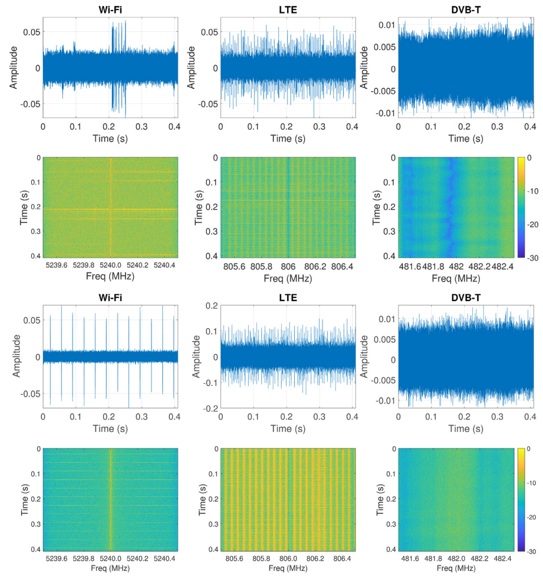

# Technology-Recognition-dataset-of-real-life-LTE-WiFi-and-DVB-T
Dataset with IQ signals captured from multiple Wireless technologies (LTE, Wi-Fi and DVB-T) deployed in multiple environments.

## Dataset description
This dataset contains IQ samples captured over-the-air in six different locations in Gent, Belgium (UZ, Reep, Rabot, Merelbeke, iGent and Gentbrugge).

Each location has unique data characteristics (e.g. different signal strength and noise levels) due to different physical signal propagations. As an example, these differences in two locations (top two and bottom two rows) are displayed on the spectrograms below:

The sampling rate used was 1M samples per sec. If it is not the case, it is mentioned in the file name. 

More details can be found in two of our publications [1] and [2]. Please always refer to these when using our dataset.

[The dataset can be downloaded here.](https://cloud.ilabt.imec.be/index.php/s/qrJCWgzQaGPfHPr)

## File naming convention
The .bin file naming convention is as follows: 

Technology-name”sampling-frequency”_USRP-gain_center-frequency_file-name

For example, wf10Msps_g76_rabot_f5240MHz_r1.bin

Wf = WiFi 
Sampling frequency = 10Msps
USRP gain = 76dB
Center frequency = 5240 MHz

## Data processing
An example script (script_for_Accessing_bin_files.m) is provided to process the binary files with MATLAB.

## References

[1] Fontaine, J., Fonseca, E., Shahid, A., Kist, M., DaSilva, L. A., Moerman, I., & De Poorter, E. (2019). Towards low-complexity wireless technology classification across multiple environments. Ad Hoc Networks, 91, 101881.

[2] Liu, W., Kulin, M., Kazaz, T., Shahid, A., Moerman, I., & De Poorter, E. (2017). Wireless technology recognition based on rssi distribution at sub-nyquist sampling rate for constrained devices. Sensors, 17(9), 2081.

## Contact
If you need any further details about the dataset, then you can contact at jaron.fontaine@ugent.be or adnan.shahid@ugent.be
